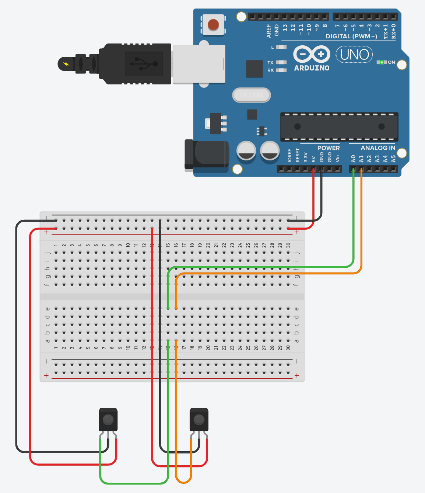

# Project for Ureckon Innovation Challenge 2023

### Made by:
* Sankalpa Dutta, 1st Year, CSE (IoT)
* Dhruba Dutta Banik, 1st Year, CSE (IoT)
* Disha Laskar, 1st Year, CST
* Arkapravo Ghosh, 1st Year, CSE (IoT)
* Mahak Gupta, 2nd Year, CST

# Hardware

    
Using Arduino Uno and Raspberry Pi

## Raspberry Pi
Configure the Raspberry Pi to run [this file](src/server/main.py) on boot. This file will capture data from Serial
Monitor and store it in a MariaDB Database.
## Arduino Uno
Upload the [Source Code](src/arduino/main) to Arduino Uno Board, then create the circuit as shown below:
<!--

--->

&nbsp;&nbsp;

> This circuit will read the data from the IR sensors and send it to the Raspberry Pi via Serial Monitor.

    
Using Raspberry Pi only

## Raspberry Pi
Configure the Raspberry Pi to run [this file](src/alternate/main.py) on boot. This file will capture data from the
IR sensors via GPIO Pins and store it in a MariaDB Database.

Refer to the following diagram for Rasberry Pi 4 Model B to understand GPIO Pins

&nbsp;&nbsp;

* Connect Ground Pin of Raspberry Pi to the GND Pins of both the IR Sensors
* Similarly, connect any of the 5V Power pins of Raspberry Pi to the VCC Pins of both the IR Sensors
* Connect GPIO 22 (Pin 15) of Raspberry Pi to OUT Pin of the IR Sensor at Parking Slot 1
* Similarly, connect GPIO 23 (Pin 16) of Raspberry Pi to OUT Pin of the IR Sensor at Parking Slot 2

